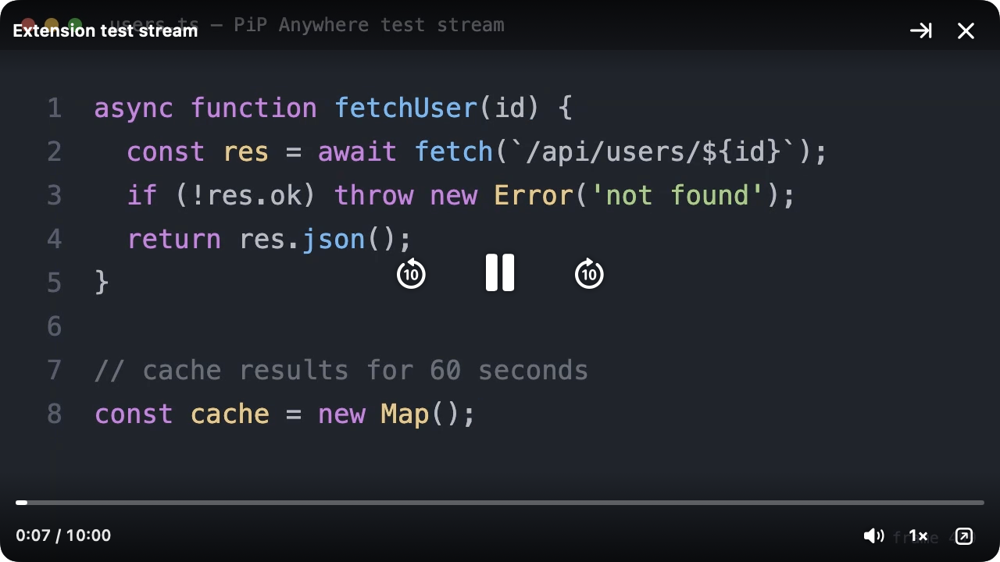
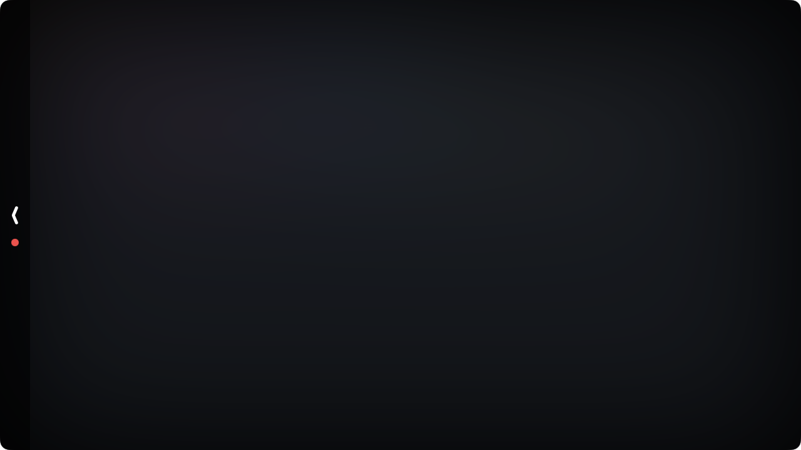
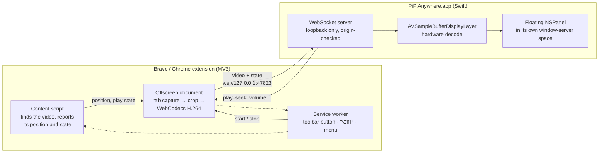

<div align="center">

# PiP Anywhere

**Picture-in-picture for Brave and Chrome that stays on top of _everything_ on your Mac: other desktops, full-screen apps, and desktop swipes.**

[](https://github.com/Naman503/pip-anywhere/actions/workflows/ci.yml)


[](LICENSE)



</div>

---

## Why

Brave's and Chrome's built-in picture-in-picture **disappears as soon as you switch to an app in full-screen mode**. The window is a regular browser window, and macOS doesn't layer those over other apps' full-screen Spaces. The bug has been reported since 2020 and no browser setting fixes it.

PiP Anywhere moves the video into a small native Mac window that:

- stays visible over full-screen apps;
- stays on every desktop;
- doesn't even move while you swipe between desktops with four fingers.

## Features

**Always on top, everywhere**
- Visible over native full-screen apps (Xcode, Safari, Keynote…) and on every desktop.
- Stays perfectly still during four-finger desktop swipes; it doesn't slide out and back in.
- Never steals focus from the app you're working in.

**Out of your way**
- **Slide to the edge.** Flick the window past the screen edge, or press `⌃⌥P`. Only a thin tab with a "playing" dot stays visible, and the video behind it is **heavily blurred**. Click the tab and it returns to exactly where it was.
- **Put it anywhere,** even half off the side of the screen. Corner snapping is optional.
- **Ghost mode** (`⌃⌥G`): see-through, and clicks pass through to the window underneath.
- Optional **hide from screen sharing**.

**Size**
- Drag any edge or corner (aspect ratio kept), pinch on the trackpad, or press `⌃⌥=` / `⌃⌥-`.
- Ranges from 200 pt wide up to the full screen.
- **Double-click** to switch between big and your size.
- Size presets and *move to corner* in the menu.

**Playback**
- Play/pause, ±10 s, seek bar, speed from 0.75× to 3× (including 2.85×), volume and mute. Everything controls the real tab.
- Scroll up/down over the video for volume, sideways to seek.
- Global shortcuts work from any app, including full-screen ones.
- Up to **60 fps**, hardware-encoded and hardware-decoded H.264, with low latency.
- Sound keeps playing from the browser tab, so there's no audio drift.

**Private by design**
- Nothing leaves your Mac. Video travels over a loopback-only socket (`127.0.0.1`).
- The app only accepts connections from this extension's fixed ID. Web pages can't connect or send it video.

<p align="center">
  <br>
  <sub>Slid into the edge: the visible strip is blurred so nobody can see what's playing.</sub>
</p>

## How it works



1. **Capture.** The extension captures the tab with `chrome.tabCapture` (video only, so the tab keeps its sound) and crops each frame to the video's rectangle. It then encodes H.264 with WebCodecs at up to 60 fps. Chromium keeps rendering a captured tab even when the browser is hidden or minimized.
2. **Stream.** Frames and playback state go to the app over a WebSocket bound to `127.0.0.1`. The app rejects any `Origin` except the extension's pinned ID.
3. **Show.** The app feeds the stream to an `AVSampleBufferDisplayLayer`, which decodes it in hardware. That layer sits inside a non-activating `NSPanel` that can join full-screen Spaces.
4. **Stay still.** The panel is moved into its own window-server space, so desktop swipes don't move it. This is the same technique SketchyBar's "sticky" mode uses.
5. **Control.** Buttons, shortcuts and scroll gestures in the window are sent back to the tab's `<video>` element.

The full design, wire format and the experiments behind each decision are in [`docs/`](docs).

## Requirements

- macOS 14 Sonoma or later. Tested on macOS 26 Tahoe.
- Brave or Google Chrome 116+, or another Chromium browser.
- To build: Xcode 16+ (Swift 6) and Node.js 20+.

## Installation

### 1. Build and install the app

```bash
git clone https://github.com/Naman503/pip-anywhere.git
cd pip-anywhere/app
scripts/bundle.sh
cp -R "build/PiP Anywhere.app" /Applications/
open "/Applications/PiP Anywhere.app"
```

A **PiP** icon appears in the menu bar. To start it automatically, turn on **menu → Open at login**. To check the window without a browser, use **menu → Show test pattern**.

> The app is ad-hoc signed, not notarized. If you download a prebuilt copy from [Releases](https://github.com/Naman503/pip-anywhere/releases) instead of building it, macOS will block it the first time. Right-click the app, choose **Open**, or run `xattr -dr com.apple.quarantine "/Applications/PiP Anywhere.app"`.

### 2. Load the extension

```bash
cd ../extension
npm install
npm run build
```

1. Open `brave://extensions` (or `chrome://extensions`) and turn on **Developer mode**.
2. Click **Load unpacked** and select the `extension/dist` folder.
3. Pin **PiP Anywhere** to the toolbar.

## Usage

Open any page with a video and press **`⌥⇧P`**, click the toolbar button, or right-click → **Pop out with PiP Anywhere**. Do the same again, or press ✕, to stop.

| | |
|---|---|
| **Move** | Drag the video anywhere. |
| **Resize** | Drag an edge or corner, pinch, `⌃⌥=` / `⌃⌥-`, or menu → *Size*. |
| **Big / normal** | Double-click the video. |
| **Slide to the edge** | Flick it past the left or right edge, the ⇥ button, or `⌃⌥P`. Click the tab or press `⌃⌥P` to bring it back. |
| **Play / pause** | Hover controls or `⌃⌥Space`. |
| **Seek** | `⌃⌥←` / `⌃⌥→` (10 s), scroll sideways (5 s), or drag the progress bar. |
| **Volume** | Scroll up/down, the speaker button, or `⌃⌥M` to mute. |
| **Speed** | Hover controls → `1×` menu. |
| **Back to the tab** | ↗ button or `⌃⌥B`. Focuses the tab and closes the window. |
| **Ghost mode** | `⌃⌥G`. See-through, and clicks pass through. |

The menu bar icon also has:
- opacity;
- corner snapping;
- pause or mute while slid away;
- the progress line;
- scroll gestures;
- hide from screen sharing;
- window level;
- a list of all shortcuts.

### Automation

The app listens for the distributed notification `local.pipanywhere.command`, so Shortcuts, Raycast or a script can drive it:

```bash
swift spikes/send-command.swift toggle            # play / pause
swift spikes/send-command.swift seek:-10
swift spikes/send-command.swift volume:0.5
swift spikes/send-command.swift window:stash
swift spikes/send-command.swift window:corner:bottomRight
```

The available commands are:
- `play`, `pause`, `toggle`
- `seek:<s>`, `seekTo:<s>`, `rate:<x>`, `volume:<0–1>`, `mute:<0|1>`
- `focusTab`, `close`
- `window:stash`, `window:unstash`, `window:show`, `window:hide`
- `window:ghost`, `window:grow`, `window:shrink`, `window:zoom`
- `window:width:<pt>`, `window:corner:<topLeft|topRight|bottomLeft|bottomRight>`
- `snapshot:<path.png>`

## Limitations

- **DRM video** (Netflix, Prime Video, Disney+) can't be captured and shows black. Use Safari's built-in PiP for those.
- **The video must stay within its tab's visible area.** The extension scrolls it into view when you start. Switching tabs, switching desktops or minimizing the browser is fine.
- **Sharpness follows the video's size on the page.** Theater mode or a bigger browser window gives a sharper picture.
- **The app must be running.** The extension shows a red `!` if it isn't. Turn on *Open at login* in the menu.
- **Private macOS APIs.** "Stay still while switching desktops" and the resize cursor use private SkyLight window-server calls, loaded at runtime. If a future macOS removes them, those two features switch off and everything else keeps working.

## Development

```
app/                 macOS app (SwiftPM)
  Sources/PiPCore/       protocol + window geometry (pure logic, unit-tested)
  Sources/PiPAnywhere/   panel, video renderer, WebSocket server, menu, hotkeys
  scripts/bundle.sh      builds "build/PiP Anywhere.app"
extension/           Chromium MV3 extension (TypeScript + esbuild)
  src/                   background · content · offscreen · streamer · connection
  tests/e2e.mjs          end-to-end tests with the real app and Playwright
spikes/              probes for window-server behaviour (full screen, Space switches)
docs/                plan, design decisions, wire protocol, research
```

| Command | Where | What it does |
|---|---|---|
| `swift test` | `app/` | Unit tests: protocol parsing and window geometry |
| `scripts/bundle.sh [debug]` | `app/` | Builds the `.app` |
| `npm run typecheck` · `npm run build` · `npm run dev` | `extension/` | Type-check, bundle to `dist/`, or rebuild on save |
| `node tests/e2e.mjs pipeline` | `extension/` | Test stream → encoder → app (headless) |
| `node tests/e2e.mjs youtube` | `extension/` | Real tab capture of a YouTube video: frame rate, commands, capture while minimized. Opens a browser window. |
| `swift spikes/FullscreenProbe.swift` | root | Checks the window is visible and in front over a full-screen app |
| `swift spikes/SpaceSwitchProbe.swift` | root | Checks the window doesn't move during a desktop transition |

The end-to-end tests run their own copy of the app on port 47899, so a copy you're using isn't disturbed. Set `CHROMIUM_PATH` to reuse a downloaded Chromium.

See [CONTRIBUTING.md](CONTRIBUTING.md) for conventions.

## Documentation

- [Design decisions and experiment results](docs/decisions.md)
- [Extension ↔ app wire protocol](docs/protocol.md)
- [Original plan and roadmap](docs/plan.md)
- [Background research](docs/research.md)
- [Changelog](CHANGELOG.md)

## Roadmap

- Zoom into part of the video, for reading small code in tutorials
- Captions rendered in the window
- Launching the app from the browser (native messaging)
- Signed and notarized releases

## Acknowledgements

- [SketchyBar](https://github.com/FelixKratz/SketchyBar), for the window-server "sticky space" technique.
- Apple Developer Technical Support's forum guidance on non-activating panels over full-screen Spaces.

## License

[MIT](LICENSE) © 2026 Naman Pathak
